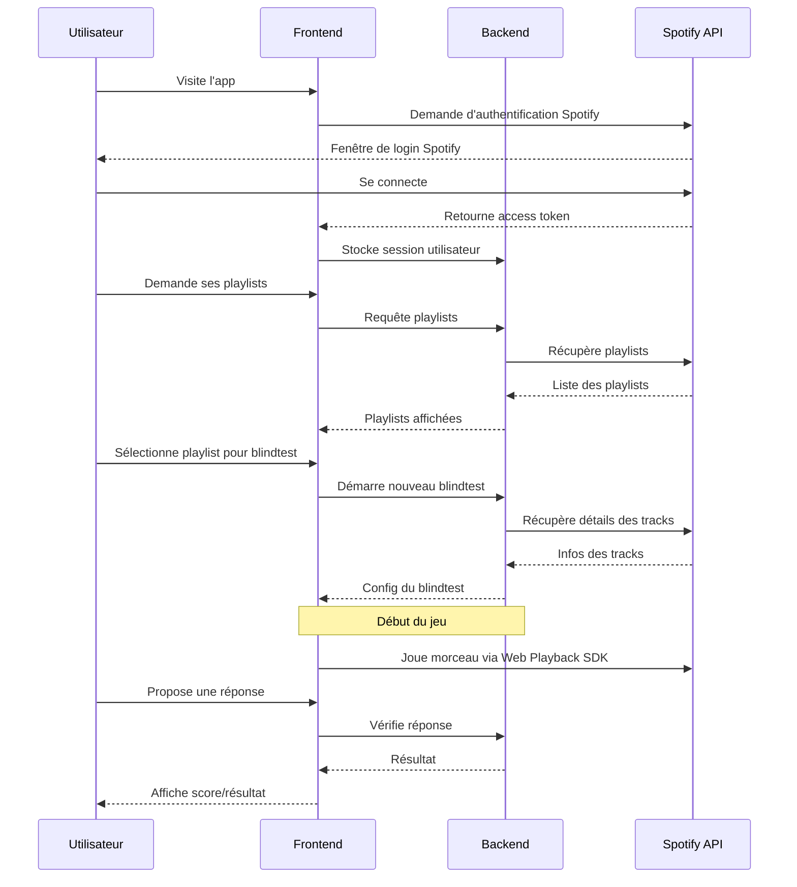

# blindotesto

use your spotify playlist as a blindtest!

# Stack de l'app

- backend : python avec fastapi
- frontend : nextjs

# Idée de base :

Use spotify api to create an app to use your playlist as a blindtest

# Idées des fonctionnalités de l'app :

- prends une playlist spotify

- raccourcis les chansons de la playlist en extraits de 15 à 30 sec

  - pendant le refrain = difficulté 1
  - avant le refrain + début du refrain = difficulté 2
  - moment aléatoire de la chanson = difficulté 3

- systeme de points et de leaderboard pour le blindtest en cours

# Diagramme :

# API

spotify api

## comment consume l'API avec python ?

utilisation de requests
